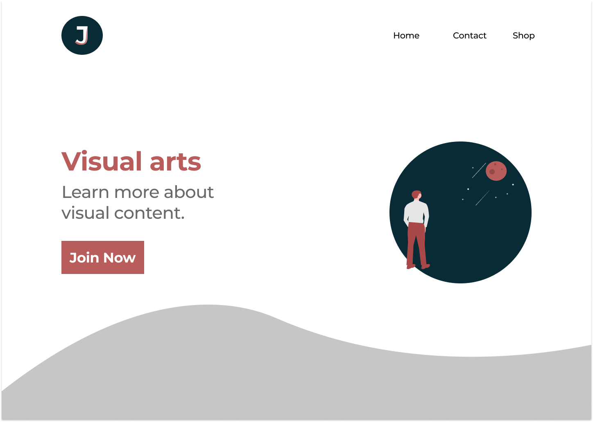

# A first stab at Figma and simple UI design

This is one of those first-stab mini project to learn a new skill. UI design has been something that I have wanted to learn for a while. Even thou i wont necessarily need to do it my self I think it's important to have some basics knowledge of what works and what makes for good UI design. I won't take credit for the design of the page as such as I just followed  [DevEds tutorial on Figma](https://www.youtube.com/watch?v=4W4LvJnNegA&t=2161s) just changing a few minor things. I also checked out a couple of tutorial on UI design and SVG (see links below). I "translated" the mockup into a "live page" on my own. The live page 
uses simple HTML SVG and CSS not to complicate things with more technologies at this stage.
The page is not yet responsive in the sense that it doesn't adapt well to different sized media (using media queries or similar).

## Tools & techs used
Going with "vanilla" techs ...

- HTML5 
- CSS3
- SVG
- Figma
- Tinypng

## The mockup and live page
So this is an png of the prototype made in Figma.

You can find the page up and running on this repos [github pages](https://janva.github.io/learningui/. )

## A few links 

- [Figma](https://www.figma.com/) A web-based vector graphics and prototyping editor + more. It's available with some limitations.

-[tinypng](https://tinypng.com/) Compresses your images vastly reducing size of image with nearly invisible change.

- [DevEds tutorial on figma](https://www.youtube.com/watch?v=4W4LvJnNegA&t=2161s). A tutorial on basics of figma.

- [ beginners guide to SVG](https://www.youtube.com/watch?v=ZJSCl6XEdP8) Covering basics
of SVG.

- [UI design crash course for beginners](https://www.youtube.com/watch?v=_Hp_dI0DzY4&t=1232s)
  Teaching basic UI design principles. There's an updated version the [2020 UI design fundamentals](https://www.youtube.com/watch?v=tRpoI6vkqLs).

